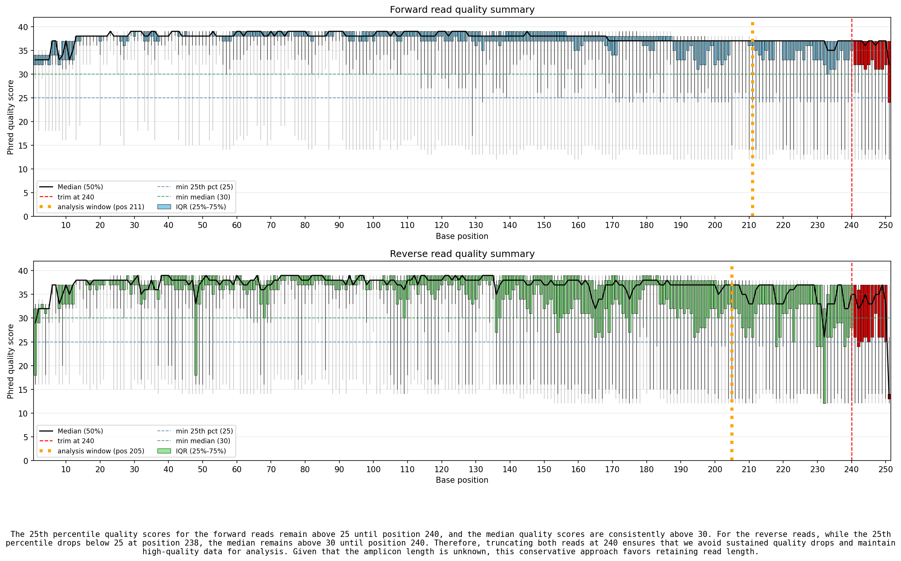
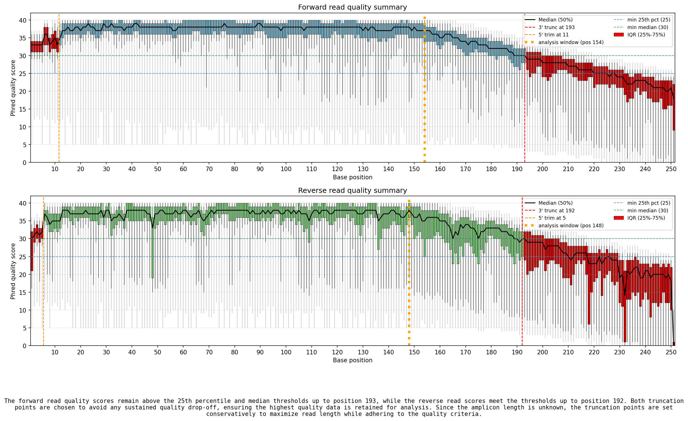

# ai_quality_threshold

Use an LLM to automatically suggest trimming thresholds based on quality criteria. The output may be used in automation to skip a manual step, furlow poor quality samples, or simply evaluate quality.

<a href="img/ai_quality_threshold_plot_good.png"></a><a href="img/ai_quality_threshold_plot_degrade_global_2.png"></a>

A good set of paired fastq reads *top* and a degraded set *bottom*. The red area shows the AI recommended trim. Click on the image to see more detail, including the AI generated rationale below the plots.

### Description

This repo contains a script to ask AI to apply specific rules to data in order to suggest quality trimming parameters. The performance depends on the data, so this repo also contains a framework for randomly degrading the quality scores of a given pair of fastq files. In order to do this efficiently on large files, I developed [fastq_chunk](github.com/dkbiocode/fastq_chunk), a python package for distributing a user defined function across multiple compute cores. 

## Usage

This repo applies an AI step to estimate truncation parameters from fastq quality quantiles like those produced by the data import steps of Qiime2. 

### Examples

#### Run directly on output from Qiime2 summary object

```
python ai_fastq_choose_thresholds.py demux_summary.qzv
```

#### Run on files of quantiles in the seven-number-summaries.tsv format

```
python ai_fastq_choose_thresholds.py forward-seven-number-summaries.tsv reverse-seven-number-summaries.tsv
```

### Output

* json file with values and reasoning
* plot of qualities

#### JSON output

ai_quality_threshold_plot.json:

```json
{
  "trunc_len_f": 240,
  "trunc_len_r": 240,
  "reasoning": "The forward reads maintain a quality score above 25 (25th percentile) until position 240, while the reverse reads show a significant drop in quality starting at position 240. To ensure high-quality reads and sufficient overlap for merging, truncation is recommended at 240 for both forward and reverse reads. This truncation maintains a conservative approach given the unknown amplicon length."
}
```

Extracting values in code 

```sh
python ai_fastq_choose_thresholds.py demux_summary.qzv # creates ai_quality_threshold_plot.json
trunc_f=$(jq .trunc_len_f ai_quality_threshold_plot.json)
trunc_r=$(jq .trunc_len_r ai_quality_threshold_plot.json)

qiime dada2 denoise-paired \
    --i-demultiplexed-seqs ${input_qza} \
    --p-trunc-len-r $trunc_r \
    --p-trunc-len-f $trunc_f \
    ...
```

### Not using Qiime2? Create the quantile files manually

```bash
# summarize multiple read files of forward (R1) and reverse (R2)
util/fastq_to_seven_number_summary.py --combine -o forward-seven-number-summaries.tsv *_R1_*.fastq.gz
util/fastq_to_seven_number_summary.py --combine -o reverse-seven-number-summaries.tsv *_R2_*.fastq.gz

# then create the estimated parameters
python ai_fastq_choose_thresholds.py forward-seven-number-summaries.tsv reverse-seven-number-summaries.tsv

# extract from json file
trunc_f=$(jq .trunc_len_f ai_quality_threshold_plot.json)
trunc_r=$(jq .trunc_len_r ai_quality_threshold_plot.json)
```

## Installation:

### API credentials

This script uses OpenAI (yeah, *I know*). Go to OpenAI and get an API key. This has to be in your environment for the script to make its prompt to the model.

Example .bashrc/.zshrc:

```sh
export OPENAI_API_KEY='sk-Y5lj...'
```

Relevant lines in python don't need to be changed if OPENAI_API_KEY is exported:

```python
import os # to read from user ENV
from openai import OpenAI
 
# Initialize OpenAI client
client = OpenAI(api_key=os.environ.get("OPENAI_API_KEY"))
```

### conda

#### install environment

This also installs fastq\_chunk from dkbiocode.

```
conda env create -f environment.yml
conda activate ai-fastqc-choose-point
```

#### test fastq\_chunk module import

This will list the location of the installed module, or give an error if installation failed.

```
python -c "import fastq_chunk; print(fastq_chunk.__file__)"
```

### pip (without conda environment)

```
pip install -r requirements.txt
```

#### test fastq\_chunk module import

This will list the location of the installed module, or give an error if installation failed.

```
python -c "import fastq_chunk; print(fastq_chunk.__file__)"
```
